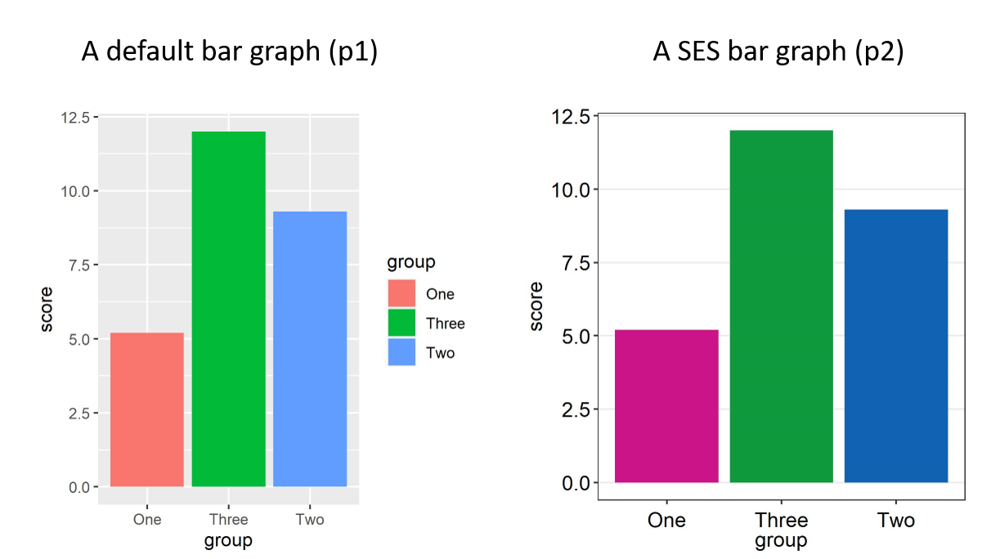
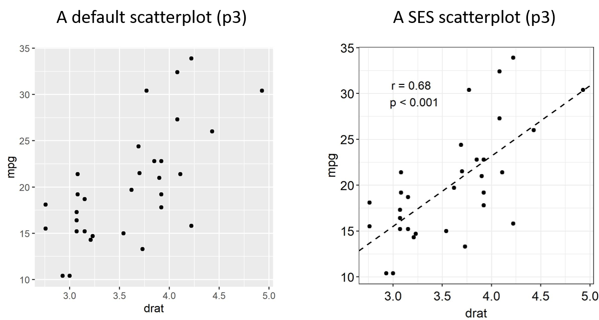
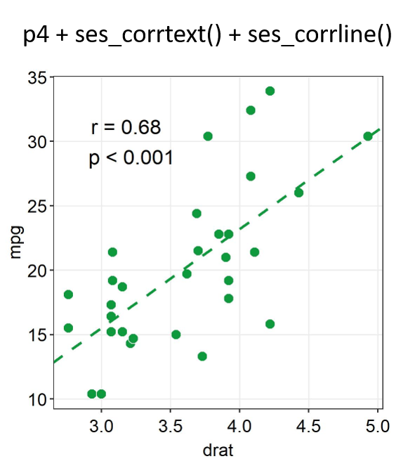
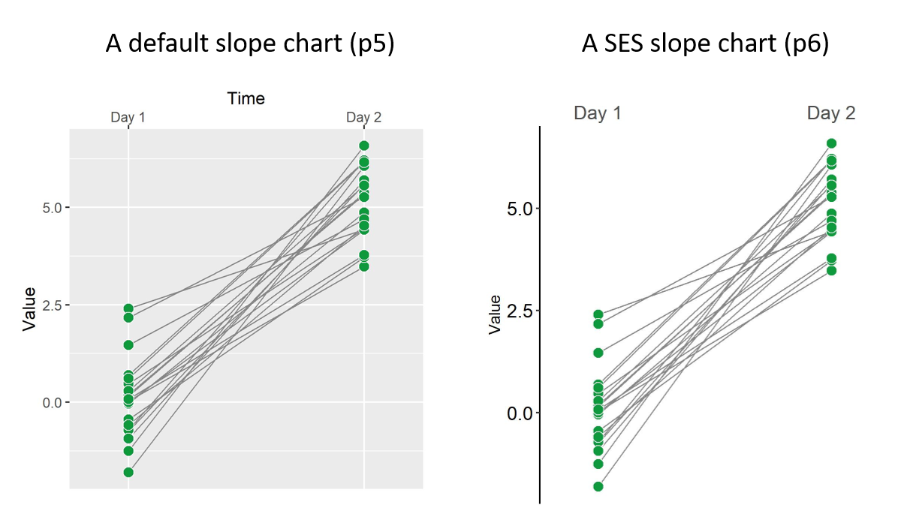

# sesplot

sesplot provides simple themes and a color palette for data visualization. It has been developed to invite people without a coding background to pick up R. Here are the SES functions:

* `ses_bar()`: a SES theme appropriate for plotting bar graphs. 
* `ses_corr()`: a SES theme appropriate for plotting correlations.
* `ses_hist()`: a SES theme appropriate for histograms.
* `ses_slope()`: a SES theme useful for plotting a slope chart.
* `ses_color()`: a SES color palette with up to 16 different colors.

These two specific functions are for correlation plots:

* `ses_corrline()`: plots the linear slope of a correlation using the function `lm()`.
* `ses_corrtext()`: prints out p- and r-values from a paired correlation test.

### Installation

``` r
install.packages("devtools")
devtools::install_github('smin95/sesplot')
```

### Set-up after installation

```r
library(sesplot) # SES
library(tidyverse) # sample data
```

### Example 1: Bar graph

```{r example}
# sample data: three groups with three different scores

df <- data.frame(group=c("One", "Two", "Three"),
                 score=c(5.2, 9.3, 12))

p1 <- ggplot(data=df, aes(x=group, y=score, fill = group)) +
  geom_bar(stat="identity") 
  
p2 <- p1 + ses_bar(legends = F) + 
scale_fill_manual(values = ses_color(3))
```


In this example, `ses_bar` is used to remove the legends and apply a minimalistic theme. Then `ses_color` is used for changing the colors of each group. In short, the texts are larger, the colors more different, and the background less distracting.

### Example 2: Correlation plot

```{r cars}
p3 <- ggplot(data = mtcars, aes(x = drat, y = mpg)) +
  geom_point(shape = 21, fill = '#0f993d', color = 'white',
             size = 3) 

p4 <- p3 + ses_corr() 

```



Notice that the text size and the background have changed using `ses_corr()`. The texts are larger and the background less distracting. 

Now let's add the linear regression slope and report the p- and r- values from a Pearson correlation test.

```r
p4.1 <- p4 + ses_corrtext(mtcars$drat, mtcars$mpg, x=3.2, y=30, method = 'pearson') +
  ses_corrline(mtcars$drat, mtcars$mpg, line_color = '#0f993d', line_size = 1)

```



Normally to do these 2 things, it can take more codes. But with the SES functions, your codes can be quite minimal and yet produce an elegant graph.

### Example 3: Slope chart

Let's generate data using random numbers. There are 20 subjects tested at two timepoints (before and after treatment). 

```r
set.seed(1)
day1 = rnorm(20,0,1)
day2 = rnorm(20,5,1)

Subject <- rep(paste0('S',seq(1:20)), 2)
Data <- data.frame(Value = matrix(c(day2,day2),ncol=1))
Time <- rep(c('Day 1', 'Day 2'), each = length(day1))

DataFrame <- cbind(Subject, Data, Time)
```

Now, let's make a slope chart.

```r
p5 <- ggplot(data = data1, 
aes(x = Time, y = Value, 
group = Subject,Fill = Time))  +
  geom_line(color = "gray53", size = .4) +
  geom_point(size = 3, shape= 21, 
  fill = '#0f993d', color = 'white') +
  scale_x_discrete(position = 'top',
  expand = c(0.15, .1), drop=FALSE)

p6 <- p5 + ses_slope()  
```



Notice that the text size and the background have changed using the SES functions, along with the ticks of the x-axis. The texts are larger,  the background less distracting, and the graph more minimalistic.
