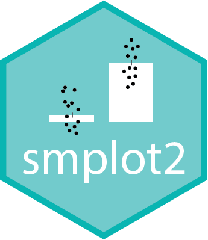

<p align="center">
  
  <h1><strong>smplot2</strong> - Create and annotate composite plots in R and ggplot2</h1>
</p>

[](https://CRAN.R-project.org/package=smplot2)

[](https://cran.r-project.org/package=smplot2)

Author: Seung Hyun (Sam) Min

**smplot2** (SM: **S**eung Hyun **M**in) is an R package for statistical data visualization that complements ggplot2. This package represents what I wish I had back when I was beginning to learn R. It aims to make every step of data visualization easy.

**smplot** was first created in May 2021, and due to the numerous deprecated and newly created primary functions, **smplot** has now evolved into **smplot2**.

Key functionalities include shortcuts for plotting elegant figures that are appropriate for scientific journals and functions that facilitate generating and annotating composite figures.

### Installation using RStudio

You can install the released version of *smplot2* from CRAN.

```r
install.packages('smplot2')
```

The development version can be directly downloaded here:

``` r
install.packages("devtools")
devtools::install_github('smin95/smplot2')
```
 
To access an updated tutorial (sample codes and figures) of the package, please visit https://smin95.github.io/dataviz/.

